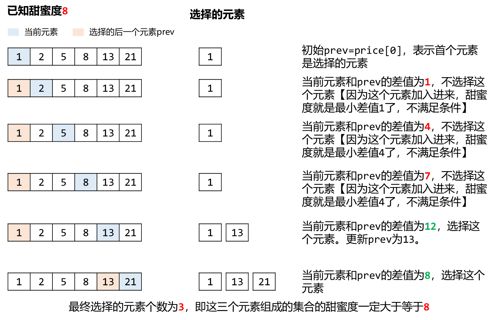

# [2517. 礼盒的最大甜蜜度](https://leetcode.cn/problems/maximum-tastiness-of-candy-basket/)

## 题目

给你一个正整数数组 $price$ ，其中 $price[i]$ 表示第 i 类糖果的价格，另给你一个正整数 k 。

商店组合 k 类 **不同**糖果打包成礼盒出售。礼盒的 甜蜜度 是礼盒中任意两种糖果 **价格** 绝对差的最小值。

返回礼盒的**最大**甜蜜度。

**示例 1：**

    输入：price = [13,5,1,8,21,2], k = 3
    输出：8
    解释：选出价格分别为 [13,5,21] 的三类糖果。
    礼盒的甜蜜度为 min(|13 - 5|, |13 - 21|, |5 - 21|) = min(8, 8, 16) = 8 。
    可以证明能够取得的最大甜蜜度就是 8 。

## 方法：贪心+二分查找

### 思路与方法

如果我们对价格数组price进行升序排序，那么最大的可能甜蜜度就是最大价格减最小价格。
我们可以使用二分查找，初始化$left = 0， right = price[n - 1] - price[0]$，在$[left, right]$中搜索最大甜蜜度。
二分查找的过程每次得到中间值$mid$，根据中间值是否满足条件来修改区间的左右边界，从而逼近目标值。这道题中中间$mid$就是我们搜索的一个甜蜜度，我们要判断的条件为：当前价格数组中是否存在至少$k$个价格满足甜蜜度$mid$。

如果满足，记录这个甜蜜度mid，可能是潜在的最大甜蜜度。然后修改下界$left = mid + 1$，在$[left + 1, right]$尝试查找更大的甜蜜度。
如果不满足，说明这个甜蜜度值大了，修改上界$right = mid - 1$，在$[left, mid - 1]$尝试查找更小的甜蜜度使得条件能够满足。
那么现在的关键点就是对于一个已知的甜蜜度$tastiness$，如何判断$price$中是否存在至少$k$个价格满足甜蜜度。
由于我们对$price$已经进行了排序，那么对一个价格$price[i]$，在它之前的价格与它的差值一定是递减，即离得越近差值越小。因此我们可以默认首个元素$price[0]$是要选择的价格，使用一个变量$prev$记录最后选择的价格，只要当前价格和最后选择的价格的差值大于等于甜蜜度，这个价格就可以加入当前组合。通过这种方式，我们选择的元素的差值一定都是大于等于已知甜蜜度的，最终元素对应的甜蜜度就是大于等于已知甜蜜度的。而我们只要校验选择的元素个数是否满足大于等于$k$即可。

~~~
class Solution {
public:
    int maximumTastiness(vector<int>& price, int k) {
        int n = price.size();
        sort(price.begin(),price.end());
        int left = 0;
        int right = price[n-1]-price[0];
        while(left<right)
        {
            int mid = (left +right+1) >>1;
            if(check(price,k,mid))
            {
                left = mid;
            }
            else{
                right = mid-1;
            }
        }
        return left;
    }

    bool check(vector<int>& price,int k,int gap)
    {
        int prev = INT_MIN >>1;
        int cnt = 0;
        for(auto i :price)
        {
            if(i-prev>=gap)
            {
                prev = i;
                cnt++;
            }
        }
        return cnt>=k;
    }
};
~~~