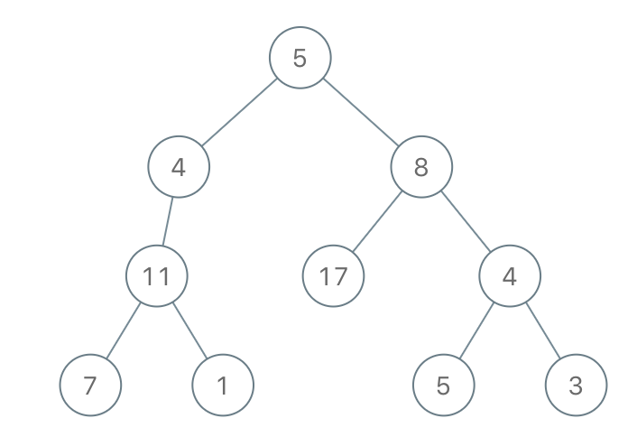

# [1080. 根到叶路径上的不足节点](https://leetcode.cn/problems/insufficient-nodes-in-root-to-leaf-paths/)

## 题目

给你二叉树的根节点 root 和一个整数 limit ，请你同时删除树中所有 不足节点 ，并返回最终二叉树的根节点。

假如通过节点 node 的每种可能的 **“根-叶”** 路径上值的总和全都小于给定的 limit，则该节点被称之为 **不足节点** ，需要被删除。

叶子节点，就是没有子节点的节点。

示例 1：

    输入：root = [1,2,3,4,-99,-99,7,8,9,-99,-99,12,13,-99,14], limit = 1
    输出：[1,2,3,4,null,null,7,8,9,null,14]

示例 2：

    输入：root = [5,4,8,11,null,17,4,7,1,null,null,5,3], limit = 22
    输出：[5,4,8,11,null,17,4,7,null,null,null,5]

## 方法：DFS

### 思路与分析

首先先解释什么是**根-叶**路径，根-叶路径指的是起点为根节点，终点为叶子节点的路径。可以推断，有多少个叶子节点就有多少条根-叶路径。题目中满足要求的根-叶路径是该路径上的值和大于最低限制limit。对于节点note，如果没有一条满足要求的根-叶路径通过它的话，note节点就是**不足节点**，需要被删除。

对于叶子节点，满足要求的根-叶路径只有一条，就是从根到其自身的那一条路径。如果这条路径无法满足要求的话，就可以将其删除。

对于中间节点，通过其的根-叶路径可能有多条，而且路径的重点必定在以这个节点为根的子树内。换句话说就是根-叶路径的终点一定是该中间节点的孩子。所以说，当我们从底层DFS遍历上来，如果节点还有孩子没有被删除，就代表着存在着一条可行的根-叶路径。所以，只有当中间节点没有孩子之后，才可以被删除。

所以在DFS递归的时候，沿着树向下传递一个参数up，用来记录从根出发的路径的值和。DFS递归，如果是叶子节点就进行limit判断，判定通过就返回false。空子树和判定失败均返回true。当递归到中间节点的时候，左右子树都返回true的话代表中间节点可以删除。

#### C++代码
~~~
class Solution {
public:
    bool DFS(TreeNode* &root,int up,const int & limit)
    {
        if(root==nullptr){
            return true;
        }
        if(root->left==nullptr&&root->right==nullptr)
        {
            if(up+root->val<limit)
            {
                root = nullptr;
                return true;
            }
            return false;
        }
        int new_up = up+root->val;
        bool left = DFS(root->left,new_up,limit);
        bool right = DFS(root->right,new_up,limit);
        if(left&&right)
        {
            root = nullptr;
            return true;
        }
        return false;
    }

    TreeNode* sufficientSubset(TreeNode* root, int limit) {
        DFS(root, 0, limit);
        return root;
        
    }
};
~~~

### 复杂度分析

#### 时间复杂度

$O(n)$遍历树的操作是$O(1)$的，每个节点值遍历一遍。

#### 空间复杂度

$O(n)$遍历树的操作是$O(1)$的，每次遍历开辟了一些中间变量用来存放递归信息。
