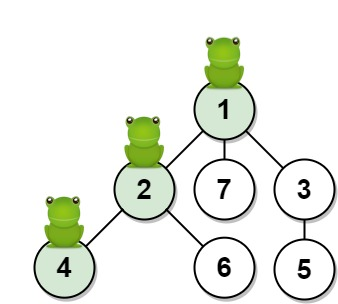
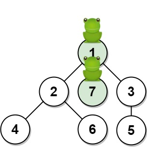

# [1377. T 秒后青蛙的位置](https://leetcode.cn/problems/frog-position-after-t-seconds/)

## 题目

给你一棵由 n 个顶点组成的无向树，顶点编号从 1 到 n。青蛙从 顶点 1 开始起跳。规则如下：

在一秒内，青蛙从它所在的当前顶点跳到另一个 未访问 过的顶点（如果它们直接相连）。
青蛙无法跳回已经访问过的顶点。
如果青蛙可以跳到多个不同顶点，那么它跳到其中任意一个顶点上的机率都相同。
如果青蛙不能跳到任何未访问过的顶点上，那么它每次跳跃都会停留在原地。
无向树的边用数组 edges 描述，其中 $edges[i] = [ai, bi]$ 意味着存在一条直接连通 ai 和 bi 两个顶点的边。

返回青蛙在 t 秒后位于目标顶点 target 上的概率。与实际答案相差不超过 $10^{-5}$ 的结果将被视为正确答案。

**示例 1：**

    输入：n = 7, edges = [[1,2],[1,3],[1,7],[2,4],[2,6],[3,5]], t = 2, target = 4
    输出：0.16666666666666666 
    解释：上图显示了青蛙的跳跃路径。青蛙从顶点 1 起跳，第 1 秒 有 1/3 的概率跳到顶点 2 ，然后第 2 秒 有 1/2 的概率跳到顶点 4，因此青蛙在 2 秒后位于顶点 4 的概率是 1/3 * 1/2 = 1/6 = 0.16666666666666666 。 

**示例 2：**

    输入：n = 7, edges = [[1,2],[1,3],[1,7],[2,4],[2,6],[3,5]], t = 1, target = 7
    输出：0.3333333333333333
    解释：上图显示了青蛙的跳跃路径。青蛙从顶点 1 起跳，有 1/3 = 0.3333333333333333 的概率能够 1 秒 后跳到顶点 7 。 

## 方法：父指针+哈希

### 思路与分析

本题中的数据结构是一个无向树的结构。青蛙从1号节点开始跳到另一个未被访问过的直接相连的节点。由于树中没有环，而且不允许重复遍历。所以，我们可以把1看作是根节点，青蛙就是从根节点开始不走回头路地顺着树枝向下走到某一个叶子节点。

结合一点概率论的知识，以示例一为例进行解释，1节点有三个儿子，所以青蛙跳到值为2的儿子的概率为$\frac{1}{3}$.所以父节点有几个儿子，选择某个特定儿子的概率就是几分之一。

不考虑青蛙的跳数，青蛙跳到指定的节点的概率为$1/n$,其中n为根到这个节点路径上不包含该节点的其他节点的儿子数的乘积。想**要求从1号开始跳到任意节点的概率，只需要将其儿子数相乘即可。**

我们维护一个**哈希表**，记录每一个节点的儿子数量。对于读取的每一条边的信息，为了后续的算法，我们需要将这个树构建成一个单一父亲多个儿子的树。对于每一条边的信息，我们做以下处理：

- 如果边信息中有一个是1，则将1作为父亲。
- 如果边中有一个节点已经有了父亲，将其作为两个节点中的父亲节点。
- 如果两个节点都没有父亲，随机选择一个作为父亲。

我们维护一个数组，这个数组存放的是每个节点的父节点的编号。这样，我们人工构建出了一个有**父指针的有向树**。

接着我们从指定节点**自底向上**回溯整个树。记录一个ans值，ans初始值为1，每次找到父亲节点并将其儿子数量乘到ans上。每次回溯将t减1，表示一次跳跃。循环有两个退出的条件：

- 回溯到根节点。此时判断目标节点是不是叶子节点，如果是叶子节点，青蛙在剩下的跳数会在原地跳，是可以的。但是如果目标节点不是叶子节点而且还有剩余跳数，青蛙不会在这个节点停留，所以返回0.其余情况返回ans的倒数。
- 还没有回溯到根节点但是已经t已经等于0，也就是跳不到根节点了。此时是不可能跳到该节点的，因为跳数不够。所以返回0。

**C++代码**
~~~
Class Solution {
public:
    double frogPosition(int n, vector<vector<int>>& edges, int t, int target) {
        unordered_map<int,int>count;
        vector<int>father(n+1,-1);
        for(auto edge :edges)
        {
            int begin = edge[0]==1?edge[0]:father[edge[0]]>0?edge[0]:edge[1];
            int end = begin==edge[0]?edge[1]:edge[0];
            count[begin]++;
            father[end] = begin;
        }
        int ans = 1;
        int temp = target;
        while(father[target]!=-1)
        {
            if(t==0)
            {
                return 0;
            }
            ans*=count[father[target]];
            target = father[target];
            t--;
        }
        if(t!=0&&count[temp]!=0)
        {
            return 0;
        }
        return (double)(1)/ans;

    }
};
~~~

### 复杂度分析

#### 时间复杂度

$O(n)$,主要事件在构建哈希表和父指针数组中。回溯的复杂度为$O(logn)$

#### 空间复杂度

$O(n)$ ,花费了空间在构造哈希表和父指针数组上，其大小为$O(n)$。
