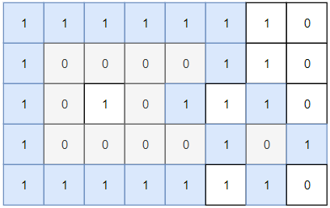
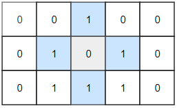

# [1254. 统计封闭岛屿的数目](https://leetcode.cn/problems/number-of-closed-islands/)

二维矩阵 `grid` 由 `0` （土地）和 `1` （水）组成。岛是由最大的4个方向连通的 `0` 组成的群，封闭岛是一个 `完全` 由1包围（左、上、右、下）的岛。

请返回 *封闭岛屿* 的数目。

 

**示例 1：**



```
输入：grid = [[1,1,1,1,1,1,1,0],[1,0,0,0,0,1,1,0],[1,0,1,0,1,1,1,0],[1,0,0,0,0,1,0,1],[1,1,1,1,1,1,1,0]]
输出：2
解释：
灰色区域的岛屿是封闭岛屿，因为这座岛屿完全被水域包围（即被 1 区域包围）。
```

**示例 2：**



```
输入：grid = [[0,0,1,0,0],[0,1,0,1,0],[0,1,1,1,0]]
输出：1
```

**示例 3：**

```
输入：grid = [[1,1,1,1,1,1,1],
             [1,0,0,0,0,0,1],
             [1,0,1,1,1,0,1],
             [1,0,1,0,1,0,1],
             [1,0,1,1,1,0,1],
             [1,0,0,0,0,0,1],
             [1,1,1,1,1,1,1]]
输出：2
```


##方法：深度优先搜索
###思路与算法

同样地，我们也可以使用深度度优先搜索代替广度度优先搜索。为了求出「封闭岛屿」的数量，可以直接扫描整个二维矩阵，如果一个位置为 0，则以其为起始节点开始进行深度优先搜索，分别向左、上、右、下四个方向进行扩展。在深度优先搜索的过程中，每个搜索到的 0 都会被重新标记为 1，同时还需检测搜索出来的区域 A 是否「封闭」。

设矩阵的行数与列数分别为 m,n，假设当前位置扩展出了矩阵的有效范围，则可以知道该区域一定存在没有被 1 包围的区域，此时则认为该连通区域一定不是「封闭岛屿」，否则即为「封闭岛屿」，最终返回「封闭岛屿」的数量即可。

~~~
class Solution {
public:
    int closedIsland(vector<vector<int>>& grid) {
        int ans  = 0;
        int m = grid.size();
        int n = grid[0].size();

        function<bool(int,int)>dfs = [&](int x,int y) ->bool {
            if(x<0||y<0||x>=m||y>=n)   //如果是边界的话，就返回false，表示并不是封闭岛屿
            {
                return false;
            }
            if(grid[x][y] != 0)        //如果遍历到的这个点不是土地，就是可以的
            {
                return true;
            }
            grid[x][y] = -1;   //标记已经遍历过
            bool ret1 = dfs(x -1 ,y);
            bool ret2 = dfs(x +1 ,y);
            bool ret3 = dfs(x  ,y-1);
            bool ret4 = dfs(x  ,y+1);
            return ret1 &&ret2&&ret3&&ret4;
        };
        for(int i = 0;i<m;i++)
        {
            for(int j = 0;j<n;j++)
            {
                if(grid[i][j] ==0&&dfs(i,j))
                {
                    ans++;
                }
            }
        }
        return ans;

    }
};
~~~

###复杂度分析

- 时间复杂度：$O(mn)$，其中 m,n 分别为矩阵的行数与列数。利用深度优先搜索只需对整个矩阵遍历一遍即可，因此时间复杂度为 $O(mn)$。

- 空间复杂度：$O(1)$。直接在原矩阵中进行标记即可，不需要额外的空间。

